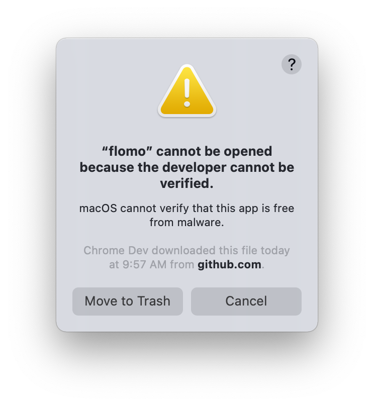
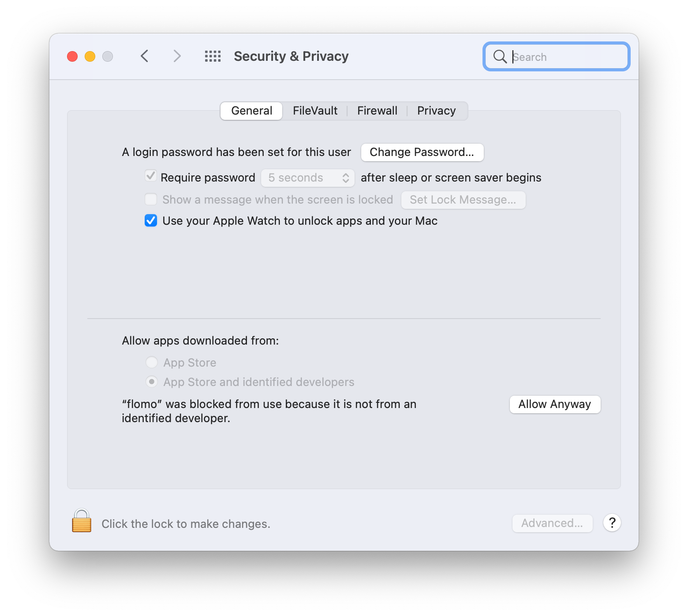

## 介绍

我为 [PopClip](http://pilotmoon.com/popclip/) 制作的一些第三方插件。  

## 使用方法  

1. 购买安装 PopClip；
2. （可选）在 Terminal.app 里运行下面的代码，使得 PopClip 允许安装第三方插件，运行完毕后重启 PopClip；
    ```
    defaults write com.pilotmoon.popclip LoadUnsignedExtensions -bool YES
    ```
3. 下载下方列表里你想要的插件，双击 `.popclipextz` 文件安装即可。

## 安全提醒

若在运行时遇到这样的报错，请不要点击「移至垃圾篓」。



打开系统偏好设置中的「安全与隐私」，点击「依然打开」即可正常运行。



## 插件列表

### [flomo](https://flomoapp.com/)

选中文字添加至 flomo。

下载：[flomo.popclipextz](https://github.com/geekdada/PopClip-Extensions/blob/master/Downloads/flomo.popclipextz?raw=true)

### 豆瓣 Douban

在豆瓣中搜索选择的短语。

下载：[Douban.popclipextz](https://github.com/geekdada/PopClip-Extensions/blob/master/Downloads/Douban.popclipextz?raw=true)
